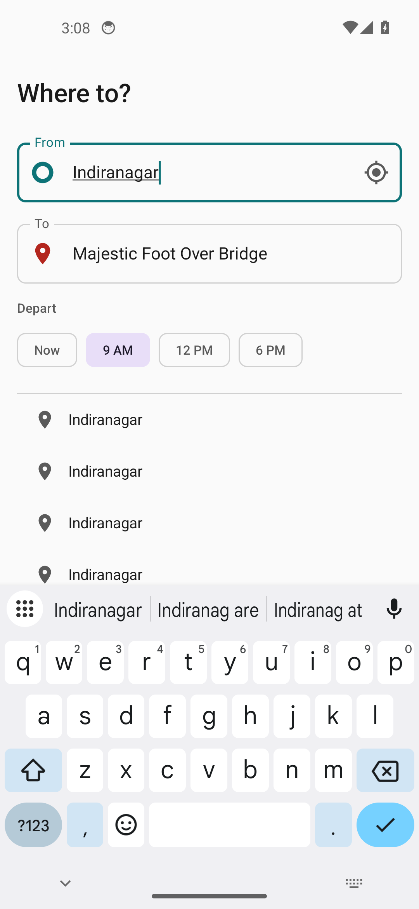
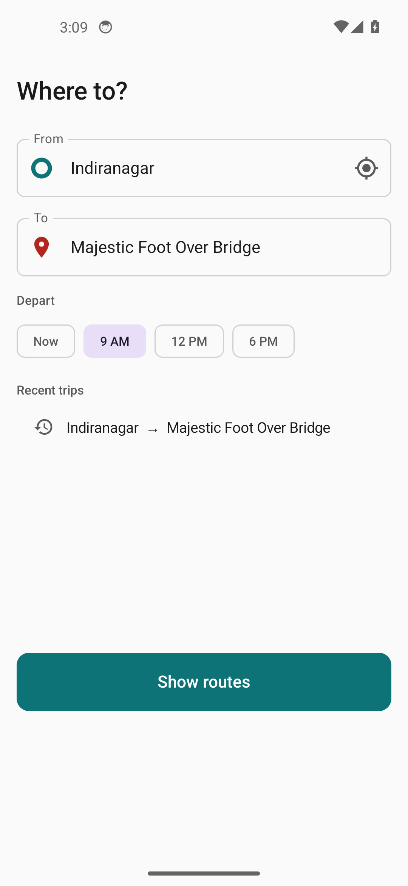
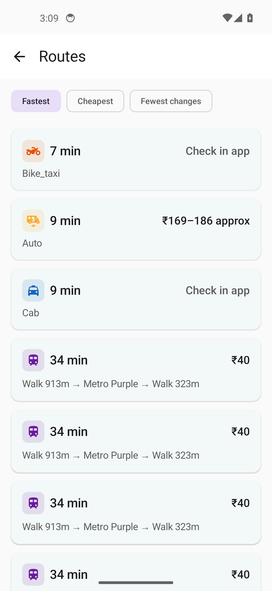
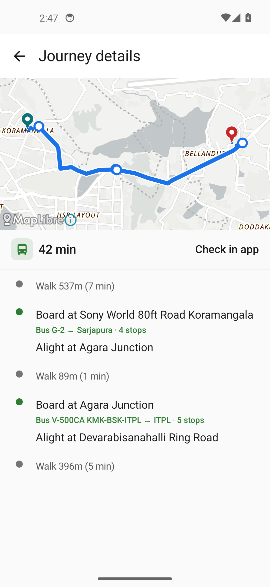

# Commute+

**Multi-modal commute planner for India.** Enter where you are and where you want to go, and
Commute+ shows every realistic way to make the trip — **bus, metro, auto-rickshaw, bike-taxi, and
cab** — side by side, with **real fares**, **exact boarding/alighting stops**, and **multi-leg
routes** (e.g. "take bus 356 to Silk Board, then bus 500 to Bellandur") when there's no direct
option.

It exists to solve a very Indian problem: when you travel to an unfamiliar city, the local commute
system is a black box — route numbers, which stop to board at, whether a metro exists, what an auto
*should* cost — and the language barrier makes it worse. Commute+ turns that local, insider
knowledge into something a newcomer can use in seconds.

> **MVP launch city: Bengaluru (Bangalore).** Every other city is added later as a data adapter, not
> a rewrite (see [Architecture](#architecture)).

---

## Screenshots

| Search + autocomplete | Recent trips | Results (all modes + fares) | Journey detail (map + steps) |
|---|---|---|---|
|  |  |  |  |

*Real data: BMTC buses + Namma Metro from official GTFS, auto fares from the Karnataka RTA card,
road distances from OpenStreetMap, and a free OpenFreeMap basemap.*

---

## Features

- **Every mode in one place.** Public transport (BMTC bus, Namma Metro) plus auto, bike-taxi and cab,
  ranked together.
- **Real fares, not guesses.**
  - **Metro & bus** — the operators' *published* fares, read straight from the GTFS `fare_attributes`
    / `fare_rules` (zone-pair fares).
  - **Auto** — computed from the official **Karnataka RTA fare card** (₹36 for the first 2 km, ₹18/km
    after, 1.5× night fare) against the **real road distance** from OpenStreetMap.
  - **Bike-taxi / cab** — no public pricing API exists, so Commute+ **never fabricates a price**;
    it deep-links into Rapido / Uber / Ola where you see the live fare and book.
- **Multi-leg journeys.** When there's no single bus/train, it chains legs — walk → bus → walk → bus
  → walk — with the transfer stops named.
- **Boarding & alighting points.** Every transit leg names the exact stop to get on and off, the route
  number, and the number of stops.
- **Map that follows the road.** The detail screen draws the route along the actual road/rail path
  (from OTP `legGeometry` + GraphHopper), with a highlighted blue line, origin/destination pins, and
  stop dots.
- **Depart now or later.** Quick presets (Now / 9 AM / 12 PM / 6 PM) — useful because buses and metro
  only run during service hours.
- **Recent trips.** Your recent searches are saved and one tap re-runs them.
- **Works offline-ish.** Results are cached (network-first, cache-fallback) so a dropped connection
  still shows your last plan.
- **Multilingual.** UI in **English, ಕನ್ನಡ (Kannada), and हिन्दी (Hindi)**.
- **$0 stack, no API keys.** Everything is open-source and self-hostable — no Google Maps, no billing
  account (see [Cost & data](#cost--data)).

---

## Architecture

Commute+ is a **client + server** system. The server does the heavy routing and holds all data
sources; the Android app is a thin, fast client.

```
┌─────────────────────────────┐         ┌──────────────────────────────────────────────┐
│  Android app (Kotlin/Compose)│  HTTPS  │  Commute+ backend (Kotlin + Ktor, :9090)       │
│  MVVM + Hilt + MapLibre       │◄───────►│   ├─ BangaloreTransitProvider (city adapter)   │
│  search → results → detail    │  REST   │   ├─ OtpRouterService  ── HTTP ─┐              │
└─────────────────────────────┘         │   ├─ RoadDistanceService (GraphHopper + OSM)   │
                                          │   ├─ GtfsFareRepository (fare_attributes/rules)│
                                          │   ├─ Fare estimators (auto RTA card, deep-links)│
                                          │   └─ PhotonGeocoder (place search)             │
                                          └───────────────────────────────────┼───────────┘
                                                                              │
                                    ┌─────────────────────────────────────────▼───────────┐
                                    │  OpenTripPlanner 2 (:8080)  — transit routing        │
                                    │  built from BMTC GTFS + Namma Metro GTFS + OSM       │
                                    └──────────────────────────────────────────────────────┘
```

**The pluggable seam:** everything city-specific lives behind the `TransitDataProvider` interface.
Bengaluru is one implementation (`BangaloreTransitProvider`). Adding Chennai or Delhi means writing a
new adapter + config — the routing engine, API, and app don't change.

**Why a separate OTP process?** OpenTripPlanner 2 runs as its own server (built from the GTFS + OSM
graph) and the backend queries it over its GTFS GraphQL API. This keeps the heavy graph work isolated
and lets data refresh without touching app code.

---

## Tech stack

**Backend**
- Kotlin + **Ktor** (HTTP API, `:9090`)
- **OpenTripPlanner 2** — multi-modal transit + walk routing (runs as a separate JVM process, `:8080`)
- **GraphHopper** — real road distance/time for auto/bike/cab, from OpenStreetMap
- **Photon** — OSM-based place search / geocoding
- kotlinx.serialization, JUnit 5

**Android**
- Kotlin + **Jetpack Compose** (Material 3), MVVM + Clean Architecture
- **Hilt** (DI), Coroutines/Flow, **Retrofit** + kotlinx.serialization
- **MapLibre** + **OpenFreeMap** tiles (open map, no API key)
- **Room** (offline cache + recent trips), DataStore, FusedLocationProvider

**Data**
- **BMTC** bus GTFS + **Namma Metro (BMRCL)** GTFS
- **OpenStreetMap** extract (Bengaluru) for walking + road routing
- **Karnataka RTA** auto fare card

---

## Repository layout

```
commute-plus/
├─ docs/
│  ├─ PLAN.md               Full architecture, roadmap, $0-stack decisions
│  ├─ SETUP.md              Step-by-step run guide
│  └─ screenshots/          README images
├─ backend/                 Kotlin + Ktor journey-planning service
│  └─ src/main/kotlin/com/commuteplus/
│     ├─ domain/            Core models + TransitDataProvider interface
│     ├─ routing/           OtpRouterService (OTP HTTP) + RoadDistanceService (GraphHopper)
│     ├─ fare/              GtfsFareRepository + BangaloreAutoFare + bike/cab deep-links
│     ├─ city/bangalore/    BangaloreTransitProvider (the city adapter)
│     ├─ geocoding/         PhotonGeocoder
│     └─ api/               Ktor routes, DTOs, mappers
│  └─ src/test/…            Unit tests (fare math, mappers, coverage)
├─ android/                 Kotlin + Jetpack Compose client
│  └─ app/src/main/java/com/commuteplus/android/
│     ├─ ui/screens/        search / results / detail (+ ViewModels)
│     ├─ ui/components/      RouteMapView (MapLibre), ModeIndicator
│     ├─ ui/theme/          Colors, type, theme (light + dark)
│     ├─ data/              Retrofit API, repository, Room, session store
│     └─ util/              Location, network monitor, deep-links
└─ .kiro/steering/          UI design guidelines
```

---

## Getting started

Full instructions are in **[`docs/SETUP.md`](docs/SETUP.md)**. In short:

### Prerequisites
- **JDK 17** (backend) and **JDK 21** (OpenTripPlanner 2)
- **Android Studio** (Hedgehog or newer) for the app
- ~1 GB disk for the transit/OSM data

### 1. Get the data (into `backend/data/`)
- **BMTC bus GTFS** — official DULT feed, or the community mirror
  [`Vonter/bmtc-gtfs`](https://github.com/Vonter/bmtc-gtfs) (`gtfs/bmtc.zip`)
- **Namma Metro GTFS** — [`Vonter/bmrcl-gtfs`](https://github.com/Vonter/bmrcl-gtfs) (`gtfs/bmrcl.zip`)
- **Bengaluru OSM extract** — from [Geofabrik](https://download.geofabrik.de) (India → Southern Zone),
  optionally cropped to the Bengaluru bounding box as `bangalore.osm.pbf`
- A `build-config.json` (already in the repo) tells OTP which feeds to load

### 2. Run OpenTripPlanner (transit routing, `:8080`)
```bash
# needs JDK 21
java -Xmx4g -jar otp-2.5.0-shaded.jar --build --serve backend/data
```

### 3. Run the backend (`:9090`)
```bash
cd backend
./gradlew run     # GraphHopper builds a road cache on first run, then serves the API
```

### 4. Run the app
Open `android/` in Android Studio and run on an emulator or device. The debug build points at
`http://10.0.2.2:9090` (the host machine as seen from the emulator).

---

## API

Base URL: `http://<host>:9090`

| Method | Path | Purpose |
|---|---|---|
| `GET`  | `/api/v1/health` | Health check |
| `GET`  | `/api/v1/search?q=<text>` | Place autocomplete (Photon/OSM) |
| `POST` | `/api/v1/plan` | Plan journeys A→B across all modes |

**Plan request**
```json
{
  "originLat": 12.9784, "originLng": 77.6408,
  "destinationLat": 12.9756, "destinationLng": 77.5713,
  "departAtEpochSec": 1785484800,
  "locale": "en"
}
```

**Plan response** (abridged) — a ranked list of journeys, each with legs, per-leg + total fare,
transfers, and an encoded route polyline; plus aggregator deep-links:
```json
{
  "origin": { "name": "Indiranagar", "lat": 12.97, "lng": 77.64 },
  "destination": { "name": "Majestic", "lat": 12.97, "lng": 77.57 },
  "journeys": [
    {
      "primaryMode": "METRO",
      "totalDurationMinutes": 21,
      "transfers": 0,
      "totalFare": { "minRupees": 40, "maxRupees": 40, "estimated": false },
      "legs": [
        { "mode": "WALK", "distanceMeters": 913 },
        { "mode": "METRO", "routeName": "Purple", "from": { "name": "Indiranagar" },
          "to": { "name": "Nadaprabhu Kempegowda" }, "numStops": 8,
          "fare": { "minRupees": 40, "maxRupees": 40, "estimated": false } }
      ]
    }
  ],
  "deepLinks": { "uber": "https://…", "ola": "https://…", "rapido": "https://…" }
}
```

---

## Cost & data

**No paid accounts, no API keys.** The entire stack is free and self-hostable:

| Concern | Choice | Cost |
|---|---|---|
| Transit routing | OpenTripPlanner 2 (self-hosted) | $0 |
| Road distance | GraphHopper + OSM (self-hosted) | $0 |
| Maps | MapLibre + OpenFreeMap tiles | $0, no key |
| Place search | Photon (OSM-based) | $0 |
| Transit data | BMTC + Namma Metro GTFS | $0 (open data) |
| Base map data | OpenStreetMap extract | $0 |

**Honest limitations**
- **Bus fare coverage is only as complete as the open feed.** The community BMTC GTFS doesn't
  enumerate every zone pair, so some bus legs show "Check in app" instead of a price. Metro fares are
  complete. Swapping in the official DULT feed improves coverage with no code change.
- **Cab/bike-taxi have no in-app price** (no public pricing API) — Commute+ deep-links to the operator
  apps rather than inventing a number.
- **Transit line geometry** follows roads only where the GTFS `shapes.txt` provides it; otherwise it's
  drawn stop-to-stop.

---

## Roadmap

- [x] Bengaluru MVP: search, multi-modal results, multi-leg transit, map, fares
- [ ] Deploy backend + OTP + Photon behind HTTPS
- [ ] Automated GTFS/OSM refresh pipeline
- [ ] More cities (each a new `TransitDataProvider`)
- [ ] Live vehicle tracking (GTFS-Realtime)
- [ ] In-app booking via aggregator partnerships

See [`docs/PLAN.md`](docs/PLAN.md) for the full plan.

---

## License & attribution

- Transit data © **BMTC** and **BMRCL** (via their open GTFS releases / community mirrors).
- Map data © **OpenStreetMap** contributors ([ODbL](https://www.openstreetmap.org/copyright)).
- Basemap tiles by **OpenFreeMap**; map rendering by **MapLibre**.
- Auto fares per the **Karnataka Regional Transport Authority** published fare card.
